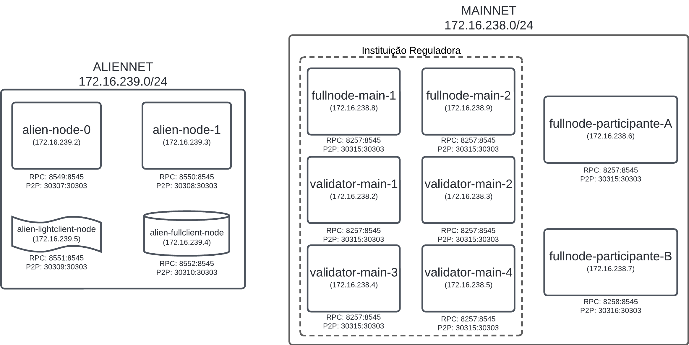

## Ambiente de Testes

A arquitetura do ambiente de testes é apresentada na Figura 1.



## Execução do Ambiente de Testes

Para executar o ambiente de testes, siga os passos a seguir:

1. Clone o repositório do projeto:

```bash
git clone https://gitlab.laspi.ufrj.br/laspi-rnd/bacen-interoperabilidade/testenv.git
git submodule update --init --recursive
```

2. Inicialize o ambiente de testes:

```bash
./run_env.sh
```

O script `run_env.sh` irá criar todos os containers necessários para a execução do ambiente de testes. Caso seja a primeira execução ou após reset do ambiente de testes, é necessário configurar o [permissionamento no ambiente de testes](#configurando-o-permissionamento-no-ambiente-de-testes). 

É possível especificar quais serviços serão executados no ambiente de testes. Para isso, basta passar -l (para Prometheus e Grafana) ou -a (para Aliennet) para o script `run_env.

```bash	
./run_env.sh -la
```

Executa a instância do Prometheus, Grafana e Aliennet junto com a rede de testes.

## Interrompendo a Execução do Ambiente de Testes

Para interromper a execução do ambiente de testes, basta executar o comando a seguir:

```bash
./stop_env.sh
```

O script `stop_env.sh` irá interromper a execução de todos os containers criados pelo script `run_env.sh`. É possível remover os arquivos temporários, perdendo COMPLETAMENTE TODOS OS DADOS da rede anterior usando a opção -r.

```bash
./stop_env.sh -r
```

## Configurando o permissionamento no ambiente de testes
<a name="permissioning"></a>
Essa etapa deve ser realizada apenas em casos de primeira execução do ambiente de testes ou após reset do ambiente de testes. Para configurar o permissionamento no ambiente de testes, execute o comando a seguir:

```bash
cd permissioning-smart-contracts
npm install --force
npm install -g truffle
truffle migrate --reset --network besu
```

Salve os endereços de deploy dos contratos de permissionamento, pois eles serão necessários para modificar a estrutura da rede de testes.

# Adicionar carteiras, nós ou administradores:

Na pasta `examples` existem exemplos de como adicionar carteiras, nós ou administradores.

# TO DO
    - Migrate from truffle to hardhat
    - RPC credentials