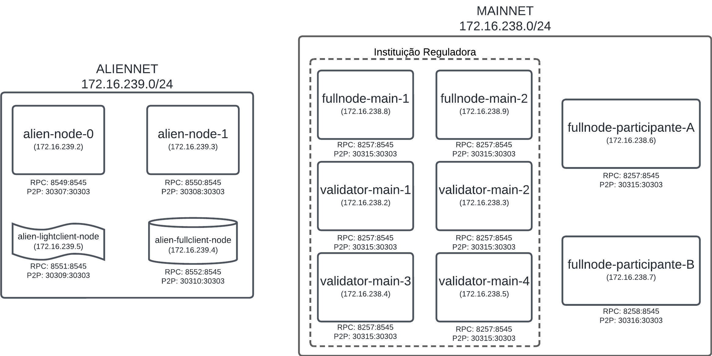

## Test Environment

The test environment architecture is presented in Figure 1.



## Running the Test Environment

To run the test environment, follow these steps:

1. Clone the project repository:

```bash
git clone https://gitlab.laspi.ufrj.br/laspi-rnd/bacen-interoperabilidade/testenv.git
npm install --save-dev hardhat
```

2. Initialize the test environment:

```bash
./run_env.sh
```

The `run_env.sh` script will create all the necessary containers for running the test environment.

It’s possible to specify which services will run in the test environment. To do so, pass -l (for Prometheus and Grafana) or -a (for Aliennet) to the `run_env` script.

```bash	
./run_env.sh -la
```

This will run instances of Prometheus, Grafana, and Aliennet along with the test network (mainnet).

## Stopping the Test Environment

To stop the test environment, run the following command:

```bash
./stop_env.sh
```

The `stop_env.sh` script will stop all containers created by the `run_env.sh` script. Temporary files can be removed, COMPLETELY DELETING ALL DATA from the previous network using the -r option.

```bash
./stop_env.sh -r
```

# TO DO
   - RPC credentials
   - create a docker compose for "DREX supernode"
   - create a docker compose for "BACEN infrastructure"
   